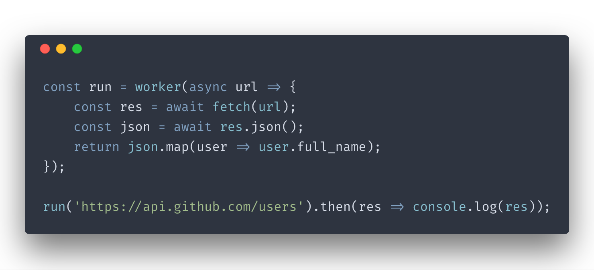

<!-- <div align="center">
  
</div> -->

# ⚙️ Worker

## ✨ Features:

-   Move a function into a web worker.
-   Supports async function.
-   Accept any [structured clone types](https://developer.mozilla.org/en-US/docs/Web/API/Web_Workers_API/Structured_clone_algorithm#Supported_types.) as arguments.
-   Accept **functions** as arguments.

See [Non blocking example](https://codesandbox.io/s/8x82oz2vz2)

## 🔧 Installation

```bash
    npm i -S @konforti/worker
```

```bash
    yarn add @konforti/worker
```

## ✏️ Usage

```js
import worker from '@konforti/worker';
```

## 🔦 Usage examples

```js
// Function in worker

function fibo(n) {
    return n > 1 ? fibo(n - 1) + fibo(n - 2) : 1;
}

const run = worker(fibo);
run(333).then(res => console.log(res));
```

```js
// Async function in worker

const run = worker(async username => {
    const url = `https://api.github.com/users/${username}/repos`;
    const res = await fetch(url);
    const repos = await res.json();
    return repos.map(r => r.full_name);
});

run('konforti').then(res => console.log(res));
```

```js
// Pass a callback function as argument

const fn = callback => `First we take Manhattan, ${callback()}`;
const run = worker(fn);
run(() => 'Then we take Berlin.').then(res => console.log(res));
```

```js
// Inject imported function into worker scope

import mathModule from './math.js';

const calc = (sum, times) => {
    const a = sum(2, 3);
    const b = times(4, 5);
    return sum(a, b);
};

const run = worker(calc);
run(mathModule.sum, mathModule.times).then(res => console.log(res));
```

## 🔏 Limitations

The function and any argument passes cannot rely on its surrounding scope, since it is executed in an isolated context.
